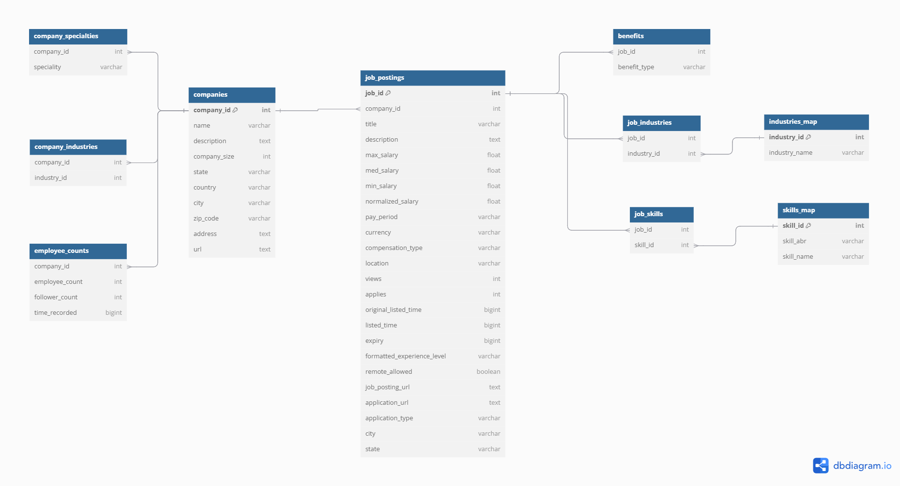
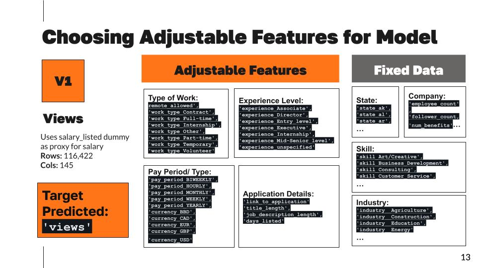
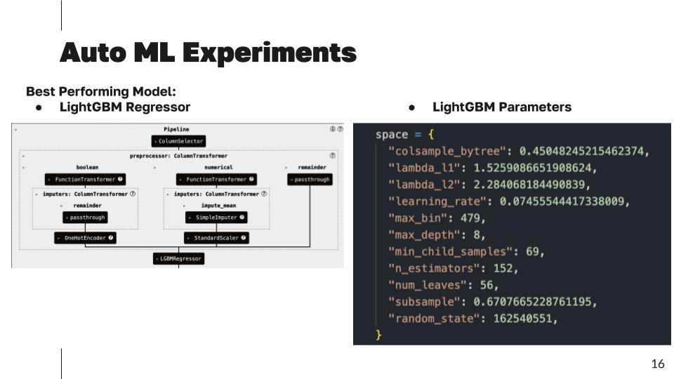
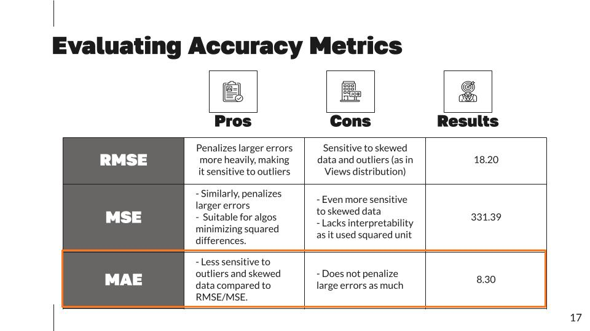
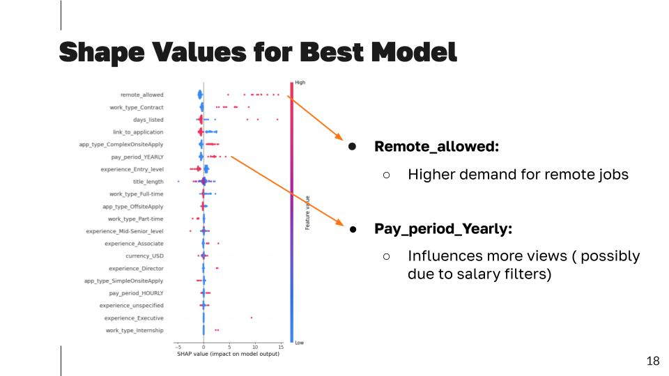
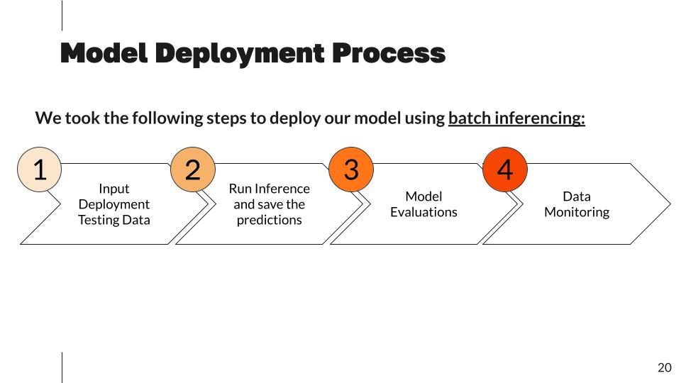
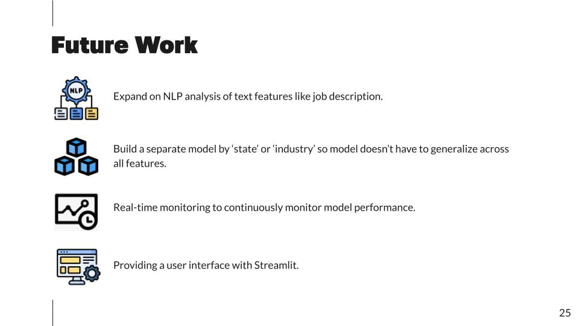

# LinkedIn Job Posting Views Prediction

## Overview
This project addresses a critical challenge for employers using LinkedIn: **maximizing job post visibility**. With thousands of posts uploaded daily, companies need insights to ensure their listings attract top talent. Using the **LinkedIn Job Postings (2023–2024)** dataset, we developed a **predictive model** to estimate the number of views a job posting will receive and identify key factors driving visibility.

---

## Business Problem

- **Challenge**: Employers struggle to make their job postings stand out in a highly competitive online market.
- **Key Metric**: Views per posting are a critical indicator of reach and engagement.
- **Goal**: Build a predictive model to estimate job post views and identify actionable strategies to enhance visibility and engagement.

---

## Data
### Source
- **Dataset**: [LinkedIn Job Postings (2023–2024) from Kaggle](https://www.kaggle.com/datasets/arshkon/linkedin-job-postings/data)
- **Size**: 124,000+ job postings.
- **Features**:
  - **Job Attributes**: Title, description, salary, location, work type, remote allowance, skills, benefits + more
  - **Company Attributes**: Size, industry, follower count, HQ location + more

### Why This Dataset?
- Reflects real-time trends in the job market.
- Highly relevant for soon-to-graduate students navigating the job search process.

---

## Data Preparation
### Database Diagram

### Key Steps
1. **Data Ingestion**:
   - Loaded the 10 CSV files seen in the above database diagram into Databricks.
   - Saved as PySpark DataFrames for easier versioning.

2. **Data Cleaning**:
   - Standardized text columns.
   - Addressed missing values in key fields (e.g., job descriptions, skills).
   - Handled duplicates and outliers (e.g., views, salary).

3. **Feature Engineering**:
   - Aggregated benefits and skills into interpretable formats.
   - One-hot encoded categorical variables.
   - Engineered new features like `num_benefits` and `salary_listed`

4. **Final Datasets**:
   - Created two modeling datasets:
     - **Views Dataset**: Focused on predicting views.
         - **Rows**: 116,422
         - **Columns**: 145
     - **Salary Dataset**: Focused on normalized salary predictions.
         - **Rows**: 33,473
         - **Columns**: 145

---

## Exploratory Data Analysis (EDA)

### Key Insights
- **Views Feature has a Right-skewed Distribution**: Most job postings receive fewer than 50 views, with a small percentage exceeding 50.
- **Engagement Correlations**:
  - **Views ↔ Applications**: Strong positive correlation.
      - This led us to remove the `applications` feature to avoid collinearity with `views`

- **Feature Trends**:
  - Majority of posts in the dataset occur during April 2024.
  - The job industries with the largest number of posts include healthcare, tech, and professional services.
  - The states with the largest number of posts are California, Texas, and New York.
  - The most frequent skills listed in job postings include information technology, sales, and management.

- **Feature Relationships**:
  - On average, tech, entertainment, and agriculture are the industries which receive the largest number of views.
  - Job posting with strategy/planning, analyst, and product management skills listed have the largest number of views, on average.
  - Including the salary as well as having remote work as an option both receive more views than not including them.

---

## Model Development
### Tools
- **Train/Test Split**: Used an 80/20 train/test split. We provide the train data to AutoML and let it do its own train/val/test splitting. Meanwhile, we save the original 20% test set to use for testing after deployment.
- **Databricks AutoML**: Automated experimentation with various algorithms.
- **Modeling Pipeline**:
  - Handled multicollinearity with Variance Inflation Factor (VIF).
  - Integrated PCA to capture variance efficiently.
  - Selected a subset of columns for feature engineering.

### Best Model
- **LightGBM Regressor**: With the following parameters

### Evaluation Metrics
- **MAE**: We chose to use MAE as our primary evaluation metric because it is less sensitive to outliers and skewed data compared to RMSE/MSE. This is important given the skewed distribution of views.

### Feature Importance
- **Shapely Feature Importance**:
   - **Remote_allowed**: Indicates higher demand for remote jobs.
   - **Pay_period_yearly**: Suggests that people are more interested in longer-term employment that can offer more financial security.

---

## Deployment
### Strategy
- **Batch Deployment**: Provides predictions for multiple job postings at once, suitable for employers posting jobs in bulk.
- **Implementation**: Deployed the best-performing model using Databricks' model registry.

---

## Model Monitoring
### Tools
- **EvidentlyAI**:
   - Removed ~200 data points before load new test dataset for deployed model (23,262 → 23,070)
   - Column Mapping:
      - target variable: `views`
      - prediction column: `prediction` to align with model output.
   - Monitoring results: 
      - slight difference in RMSE and MAE due to change in test data points but nothing noticeable.

- **Swapped Two Features With High Feature Importance**:
   - `remote_allowed`
   - `days_listed`

- **Data Stability & Drift**:
   - Mean value stability and Out-of-range values.
   - Data drift identified.

- **Performance Drift**:
   - No difference in performance identified between test_data and new_data. 

---

## Takeaways
1. **AutoML**:
   - Is a good tool for efficiently selecting a well-trained model
2. **Databricks** is a great tool for:
   - Streamlining the ML process
   - Tracking model performance
   - Reproducing the model
   - Scaling
3. **Model Performance**:
   - MAE of 8.3 is not very accurate given that the average number of views received is 10.
   - Therefore, more work needs to be done for our model to perform well enough to be used in a production setting.
4. **Feature Importance**:
   - `remote_allowed` was consistently one of the most influential features in determining how many views a posting received
5. **Business Value**:
   - While our model is not yet ready to be implemented, it has laid the ground work for further development and still has the potential to:
      - Enable companies to optimize job posts and improve engagement.
      - Offer insights for platforms like LinkedIn to enhance recommendation systems.

---

## Future Work
1. Expand on NLP analysis of text features like job description.
2. Build a separate model by state or industry so model doesn't have to generalize across all features. 
3. Real-time monitoring to continuously monitor model performance. 
4. Providing a user interface with Streamlit.

---

## Contributors
- William DeForest
- Linda Ji
- Joon Park
- Christina Song

## Dataset License
The dataset used in this project is the [LinkedIn Job Postings Dataset (2023–2024)]([https://www.kaggle.com/your-dataset-link](https://www.kaggle.com/datasets/arshkon/linkedin-job-postings/data)), licensed under the [Creative Commons Attribution-ShareAlike 4.0 International (CC BY-SA 4.0)](https://creativecommons.org/licenses/by-sa/4.0/).

### Attribution
- **Dataset Author(s)**: [Arsh Koneru, Zoey Yu Zou]
- **Link to Dataset**: [[URL to Kaggle Dataset](https://www.kaggle.com/datasets/arshkon/linkedin-job-postings/data)]
- **License**: [CC BY-SA 4.0](https://creativecommons.org/licenses/by-sa/4.0/)

Any modifications to the dataset for this project have been noted in the repository.
